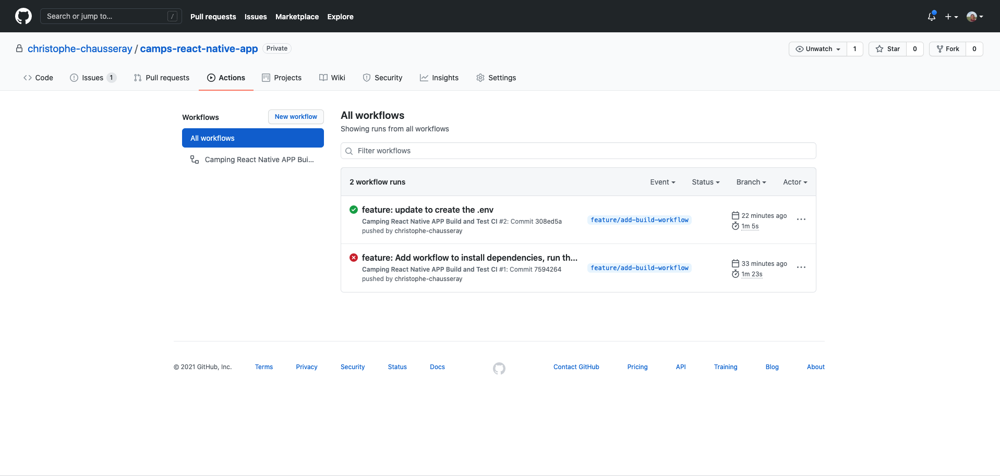

<h3 align="center">
  Camps React Native Application
</h3>

<p align="center">
  <a href="https://nodejs.org/en/">React Native Application</a>
  using <a href="https://www.apollographql.com/docs/react/">Apollo Client</a>,
  built with <a href="https://en.wikipedia.org/wiki/Continuous_integration">CI</a>.
</p>

> The goal of this React Native Application is to display all the campings around Paris with their information details and comments on IOS and Android.

<p align="center">
  <a href="#getting-started">Getting Started</a> •
  <a href="#feature">Feature</a> •
  <a href="#built-with">Built With</a> •
  <a href="#tests">Tests</a> •
  <a href="#ci-and-deployment">CI and Deployment</a> •
  <a href="#license">License</a>
</p>

## <a name="getting-started"></a> Getting Started
### Prerequisites

To install and run the Application you need to have [NodeJS](https://nodejs.org/en/download/), Android SDK and XCode.

### Installation
Clone the project, make the  installation and run the application:

```bash
https://github.com/christophe-chausseray/camps-react-native-app.git
cd camps-react-native-app
cp .env.dist .env
yarn start --reset-cache
```

Open another terminal and run :
```bash
yarn android //if you want to run on Android Device

or

yarn ios //if you to run on IOS Device
```
Your application should succesfully runs on an emulator or on Device (see this [documentation to run on device](https://reactnative.dev/docs/running-on-device)).

If you need more information about how to setup your development environment to work on Android or IOS device, I let you read this [official documentation](https://reactnative.dev/docs/environment-setup).

P.S : As the application using [Google Maps API](https://developers.google.com/maps/documentation/javascript/get-api-key) you should update the environment variable `REACT_APP_GOOGLE_MAP_API_KEY` in your .env file :
```.env
GOOGLE_MAP_API_KEY=secret
CAMPS_API_HOST=http://localhost:3000
```

## <a name="feature"></a> Feature

- [x] Display camping markers on a google map
- [x] Open a tooltip when pressing a camping marker
- [x] Display the camping information view when pressing the title tooltip
- [ ] Display the list of comments for the camping
- [ ] Add a new comment for the camping


## <a name="built-with"></a> Built with

- [React Native CLI](https://reactnative.dev/docs/environment-setup)
- [Google Maps Platform](https://developers.google.com/maps)
- [Apollo Client](https://www.apollographql.com/docs/react/)
- [React Native Testing Library](https://callstack.github.io/react-native-testing-library/)

## <a name="tests"></a> Tests

This App is tested with [React Native Testing Library](https://callstack.github.io/react-native-testing-library/) and using [Apollo Mocked provider](https://www.apollographql.com/docs/react/development-testing/testing/) for mocking the API queries in test environment.

Those tests can be run with :
```bash
yarn test
```

## <a name="ci-and-deployment"></a> CI and Deployment

This project handles the CI and deployment with [Github Actions](https://github.com/features/actions) on [Github Pages](https://pages.github.com//).



The build and deploy workflows can be found in the `.github/workflows/` directory.

The CI build will be run on the branch following the pattern `feature/**` or `fix/**`.
It will execute the linter and the test to check if the code is following the coding style of the application and if it doesn't break anything.

## <a name="license"></a> License

[MIT](https://opensource.org/licenses/MIT)

> Christophe Chausseray &nbsp;&middot;&nbsp;
> [Linkedin](https://www.linkedin.com/in/christophe-chausseray-10672140/)
